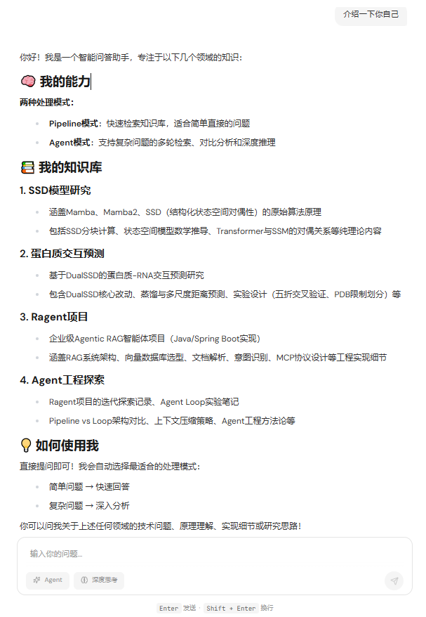
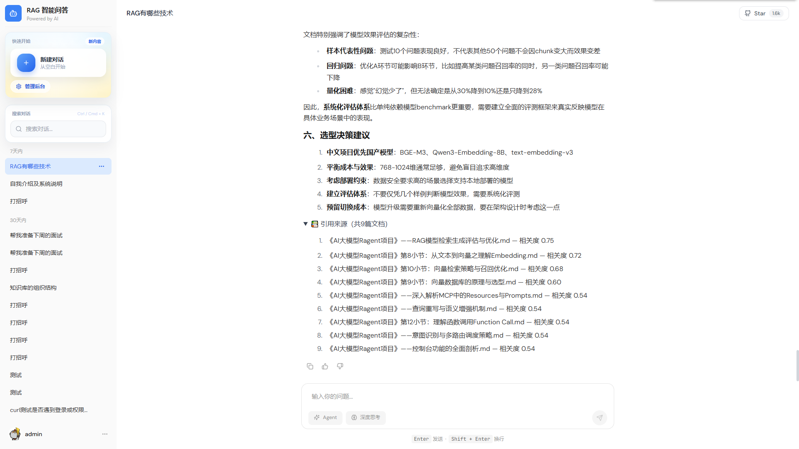

# Ragent-Lab


企业级 RAG 智能问答平台，在 Pipeline 固定流程基础上引入 Agent Loop 模式，按问题复杂度智能调度——简单问题保持低延迟，复杂问题获得多轮检索深度。

---

## 核心特性

### Agent Loop 多轮检索

模型自主驱动检索循环：判断何时需要检索、换关键词重试、切换知识库，直到获得足够信息才回答。复杂问题不再是"一次检索不行就编"，而是多轮迭代、自我纠错。



### Pipeline 与 Agent 智能协同

两种问答模式自动切换，各司其职：
- **Pipeline**：固定流程，3-5秒响应，适合简单直接的问题
- **Agent**：自主检索，10-20秒响应，适合复杂推理、多维度对比

用户无需手动选择，系统按问题特征智能路由。

### 引用溯源可信度

每条回答附带原始文档来源与相关度评分，用户可追溯答案出处，而非面对一个"黑盒"结论。



---

## 与原项目的差异

| 维度 | 原项目 | 本仓库 |
|------|--------|--------|
| 问答模式 | Pipeline 固定流程 | Pipeline + Agent 自动切换 |
| 复杂问题 | 单次检索 | 多轮迭代、自我纠错 |
| 元信息问题 | 依赖知识库内容 | 查询真实系统数据 |
| 可信度 | 无来源追溯 | 引用溯源 + 相关度评分 |
| 扩展方式 | 修改现有流程 | 实现接口即可扩展 |

---

## 快速开始

### 环境要求

Java 17+ / Node.js 18+ / MySQL 8.0+ / Milvus 2.6+ / Redis 6.0+

### 启动

```bash
git clone git@github.com:ssmiter/ragent-lab.git
cd ragent-lab

# 配置 application.yml 后启动后端
./mvnw.cmd spring-boot:run -pl bootstrap

# 启动前端
cd frontend && npm install && npm run dev
```

### 访问

- 前端界面：`http://localhost:5173`
- 智能路由端点：`/api/ragent/smart/chat`
- Agent 端点：`/api/ragent/agent/chat`
- Pipeline 端点：`/api/ragent/rag/v3/chat`

---

## 技术栈

Spring Boot 3.5 / React 18 / Milvus 2.6 / MySQL 8.0 / Redis / 百炼 API（Function Calling） / SSE

---

## 分支说明

| 分支 | 内容 |
|------|------|
| main | 稳定版本 |
| dev | 开发版本（含 TASKS、FEEDBACK、协作记录） |

---

## 致谢

基于 [nageoffer/ragent](https://github.com/nageoffer/ragent) 开发。

---

## License

Apache License 2.0