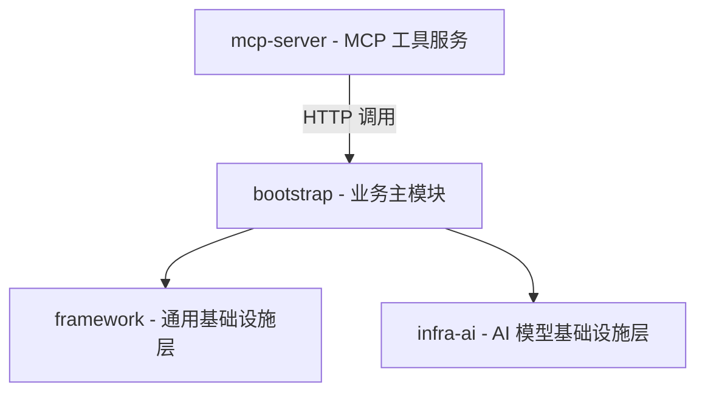

========== Agent Loop 执行报告 ==========
终止原因: COMPLETED
总轮次: 2
工具调用次数: 1

工具调用历史:
[Turn 1] knowledge_search_with_rerank({"query": "Ragent系统 整体架构", "top_k": 5}) -> ✓

最终响应:
根据知识库中高度相关（相似度 0.95）的文档《AI大模型Ragent项目——项目模块介绍》，Ragent 系统的整体架构是一个**分层清晰、职责明确、支持企业级高可用与多模型容错的 Java 微服务架构**，其核心由四大子模块构成，并辅以独立部署的服务和标准化中间件支撑。

以下是 Ragent 系统的整体架构概览：

---

### ✅ 一、整体模块划分（四层依赖结构）

| 模块 | 定位 | 关键职责 | 依赖关系 |
|------|------|-----------|-----------|
| **`bootstrap`** | **业务入口与 RAG/Agent 核心编排层** | 实现完整 RAG 流程（意图识别→检索→重排→生成）、知识库管理、用户认证、仪表盘等全部业务功能；是 Spring Boot 启动主模块。 | 依赖 `framework` 和 `infra-ai` |
| **`framework`** | **跨模块复用的通用能力层** | 提供统一响应（`Result<T>`）、标准化请求/消息结构（`ChatRequest`, `ChatMessage`）、异常体系（`BaseErrorCode`）、用户上下文（`UserContext`）、链路追踪（`RagTraceContext`）、SSE 流式推送封装等。 | 被 `bootstrap` 和 `infra-ai` 共同依赖 |
| **`infra-ai`** | **AI 模型抽象与智能调度层** | 屏蔽不同大模型厂商（百炼、SiliconFlow、Ollama）差异，提供统一接口：对话（`LLMService`）、向量化（`EmbeddingService`）、重排序（`RerankService`）；核心含**多候选模型路由 + 自动降级 + 熔断健康检查（`ModelHealthStore`）**。 | 依赖 `framework`，被 `bootstrap` 调用 |
| **`mcp-server`** | **独立部署的工具协议服务** | 实现 [MCP（Model Context Protocol）](https://modelcontextprotocol.org/) 协议，提供 `tools/list` / `tools/call` 接口；内置天气、工单等示例工具，支持插件式扩展（实现 `MCPToolExecutor` 即可注册）。 | 独立运行，通过 HTTP 被 `bootstrap` 调用 |

> 🔑 **关键设计亮点**：
> - 所有 AI 能力（LLM/Embedding/Rerank）均支持**多服务商候选 + 健康熔断 + 自动降级**，保障生产稳定性；
> - 使用 `TransmittableThreadLocal` 实现跨线程的用户上下文与链路追踪，适配异步 RAG 场景；
> - `bootstrap` 中 RAG 主流程采用**意图树（Intent Tree）驱动多通道检索**（向量检索 + MCP 工具调用），支持 KB/ SYSTEM/ MCP 三类意图精准路由。

---

### ✅ 二、核心数据流（一次 RAG 请求的典型路径）
1. **用户提问** → `bootstrap` 接收（`RagController`）
2. **意图识别** → `IntentResolver` 匹配意图树节点（如：`biz-refund-process`）
3. **查询改写 & 多路检索** → 并行触发：  
　- `VectorGlobalSearchChannel`（Milvus 向量检索）  
　- `IntentDirectedSearchChannel`（按意图限定范围检索）  
　- （若为 MCP 类型）→ 调用 `mcp-server` 获取实时数据
4. **后处理** → 去重（`DeduplicationPostProcessor`）+ 重排序（`RerankPostProcessor`）
5. **Prompt 组装 & 流式生成** → `RAGPromptService` 构建 Prompt → `LLMService` 调用 `infra-ai` → SSE 推送至前端

---

### ✅ 三、技术栈与中间件支撑（来源：[4][5]）
| 类别 | 技术选型 | 说明 |
|------|----------|------|
| **运行时** | Java 17 + Spring Boot 3.5.7 | 基于 Spring 生态构建 |
| **关系数据库** | MySQL 5.7 或 PostgreSQL 16 + pgvector | 存储元数据、用户、会话等；PostgreSQL 可直接存向量（备选方案） |
| **向量数据库** | Milvus 2.6.6 | 主力向量引擎，支持高性能相似检索 |
| **对象存储** | RustFS（替代 MinIO） | 统一存储 Milvus 索引文件 + Ragent 文档原始文件 |
| **缓存/会话** | Redis（Redisson 分布式锁） | 用户会话、意图树缓存、分布式任务协调 |
| **消息队列** | RocketMQ（可选） | 支持异步任务解耦（如文档批量处理） |
| **配置中心** | Nacos（规划中） | 后续演进方向（当前配置在 `application.yaml`） |

---

### ✅ 四、架构优势总结（来源：[1][2][3]）
- **企业级健壮性**：熔断降级、幂等提交、链路追踪、SSE 断连保护、分布式锁；
- **AI 能力解耦**：`infra-ai` 层完全隔离模型厂商，切换只需增删 Client 实现；
- **可观测性强**：Dashboard 多维监控 + 链路追踪瀑布图 + 详细分块日志；
- **灵活可扩展**：MCP 工具即插即用、数据通道（Pipeline）可视化编排、意图树动态配置；
- **开箱即用**：Docker Compose 一键部署全栈中间件（Milvus + RustFS + Redis + MySQL/PG）。

---

如需进一步了解某一层（如 `infra-ai` 的熔断机制）或某一流程（如意图树如何实现多意图分类），可随时提出，我将基于知识库细节为您展开。

来源文档：《AI大模型Ragent项目》——项目模块介绍（相似度 0.95）
========================================

进程已结束，退出代码为 0