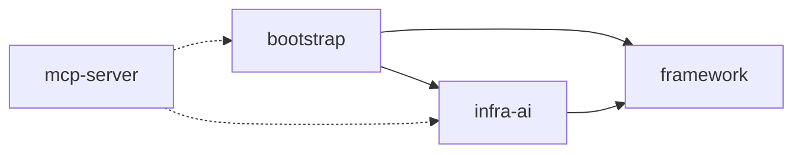

========== Agent Loop 执行报告 ==========
终止原因: COMPLETED
总轮次: 2
工具调用次数: 1

工具调用历史:
[Turn 1] knowledge_search_with_rerank({"query": "Ragent系统 整体架构"}) -> ✓

最终响应:
根据知识库检索结果，Ragent 系统的整体架构是一个**分层清晰、模块解耦、面向企业级 RAG+Agent 场景设计的 Java 微服务架构**。其核心思想是将 RAG（检索增强生成）与 Agent（智能体）能力深度融合，并通过 MCP（Model Context Protocol）协议支持工具调用，形成“知识检索 + 数据查询 + 工具执行”的统一智能交互范式。

以下是其整体架构的结构化总结（依据高相关性片段 [1]，相似度 0.95）：

---

### 🔷 一、**顶层模块划分（Maven 多模块结构）**
项目根目录下划分为 **4 个核心子模块**，依赖关系明确：

| 模块 | 定位 | 关键职责 |
|------|------|-----------|
| `framework` | **通用基础设施层** | 提供跨模块复用的基础能力：统一响应 `Result<T>`、异常体系（A/B/C 错误码）、用户上下文 `UserContext`（基于 `TransmittableThreadLocal`）、链路追踪 `RagTraceContext`、SSE 流式推送封装等。 |
| `infra-ai` | **AI 模型基础设施层** | 屏蔽大模型厂商差异，提供统一 AI 能力接口： • `chat`：多模型对话路由（百炼/SiliconFlow/Ollama），支持流式/降级/熔断 • `embedding`：向量化服务（含路由与容错） • `rerank`：重排序服务（如百炼重排模型） • `model`：核心模型路由引擎（`ModelSelector` + `ModelRoutingExecutor` + `ModelHealthStore` 熔断器） |
| `bootstrap` | **业务主模块（入口）** | RAG+Agent 核心业务实现： • `rag`：完整 RAG 流程（记忆加载 → 查询改写 → 意图识别 → 多通道检索 → 上下文组装 → 流式生成） • `ingestion`：可配置文档 ETL 流水线（Fetcher→Parser→Chunker→Indexer） • `knowledge`：知识库/文档/分块三级管理 • `admin`：Dashboard 运营看板 • `user`：Sa-Token 认证 |
| `mcp-server` | **独立 MCP 工具服务** | 实现 [MCP 协议](https://modelcontextprotocol.com/) 的 Spring Boot 应用： • 接收 `POST /mcp` 请求，解析 JSON-RPC 2.0 • 动态注册工具（如 `WeatherMCPExecutor`, `TicketMCPExecutor`） • 支持工具发现（`tools/list`）、调用（`tools/call`）和初始化 |

---

### 🔷 二、**关键分层与能力流（RAG+Agent 主流程）**
一次用户提问的端到端处理链路如下：

| 阶段 | 组件/模块 | 技术要点 |
|------|------------|----------|
| **输入预处理** | `bootstrap` + `knowledge` | • 关键词映射（规则替换） • 查询改写（结合历史会话拆解/扩展问题） • 意图识别（LLM 分类至意图树叶子节点：KB/系统回复/MCP） |
| **检索增强** | `bootstrap` (`rag`) + `infra-ai` | • 多通道并行检索：  ✓ `VectorGlobalSearchChannel`（全局 Milvus 向量检索）  ✓ `IntentDirectedSearchChannel`（按意图定向检索） • 检索后处理：去重 → 重排序（`RerankPostProcessor`）→ 结果过滤 |
| **生成与交互** | `bootstrap` (`rag`) + `infra-ai` (`chat`) | • `RAGPromptService` 组装 Prompt（含检索内容 + 系统指令） • 调用 `LLMService` 流式生成 → 通过 `SseEmitterSender` 推送前端 • 支持中断取消（`StreamCancellationHandle`） |
| **工具调用（Agent）** | `mcp-server` ↔ `bootstrap` | • 当意图为 `MCP` 类型时，`bootstrap` 向 `mcp-server` 发起 HTTP 调用 • `mcp-server` 解析请求 → 查找注册工具 → 执行 → 返回结构化结果 → 交由 LLM 组织自然语言回答 |

---

### 🔷 三、**支撑性基础设施**
- **存储层**：
    - MySQL（业务元数据：知识库/文档/用户）
    - Milvus（向量存储，用于语义检索）
    - Redis（会话缓存、分布式锁、意图树缓存）
    - RustFS（对象存储，Milvus 索引文件 + Ragent 文档原文件）
- **可观测性**：
    - 全链路追踪（`RagTraceContext` + `@RagTraceRoot/@RagTraceNode` AOP）
    - Dashboard 运营看板（成功率/响应时间/无知识率等实时指标）
- **部署架构**：
    - Docker Compose 管理中间件（Milvus/RustFS/Redis/MySQL）
    - 前端：React 18 + TypeScript + Vite
    - 后端：Spring Boot 3.5.7 + Java 17

---

✅ **总结一句话**：  
Ragent 是一个以 **Java 为主栈、模块化分层、生产就绪** 的 RAG+Agent 系统，它将知识检索（RAG）、意图理解、工具调用（MCP）、链路追踪、运营监控等能力封装为可插拔、可扩展、可运维的企业级解决方案，而非简单 Demo。

如需进一步了解某一层（如 `infra-ai` 的熔断机制、`ingestion` 流水线节点细节、或 MCP 协议交互示例），可随时提出。
========================================
补充：
---------- Turn 1 ----------
11:39:04.432 [main] INFO com.nageoffer.ai.ragent.experiment.agentloop.AgentLoop -- LLM 原始响应:
{"choices":[{"message":{"content":"问题清晰、具体，直接使用关键词“Ragent系统 整体架构”进行知识库检索。\n\n","role":"assistant","tool_calls":[{"function":{"arguments":"{\"query\": \"Ragent系统 整体架构\"}","name":"knowledge_search_with_rerank"},"id":"call_41a154e43cdd47ef9d54ee","index":0,"type":"function"}]},"finish_reason":"tool_calls","index":0}],"object":"chat.completion","usage":{"prompt_tokens":924,"completion_tokens":51,"total_tokens":975},"created":1775446741,"model":"qwen-plus-latest","id":"chatcmpl-8375632d-6453-9e1d-a3bf-79b66c9f5ebd"}
11:39:04.434 [main] INFO com.nageoffer.ai.ragent.experiment.agentloop.AgentLoop -- 模型请求调用 1 个工具
11:39:04.434 [main] INFO com.nageoffer.ai.ragent.experiment.agentloop.AgentLoop -- 执行工具: knowledge_search_with_rerank({"query": "Ragent系统 整体架构"})
11:39:06.770 [main] INFO com.nageoffer.ai.ragent.mcp.tools.KnowledgeSearchWithRerankMCPExecutor -- knowledge_search_with_rerank 执行完成, query=Ragent系统 整体架构, 返回5个片段
11:39:06.774 [main] INFO com.nageoffer.ai.ragent.experiment.agentloop.AgentLoop -- 工具结果: 找到 5 个相关片段：